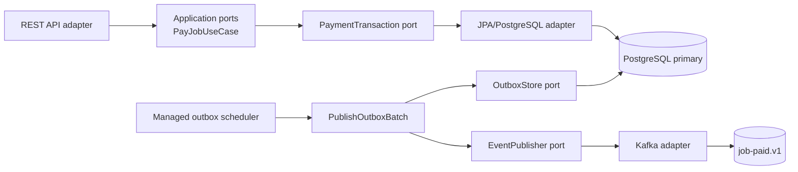
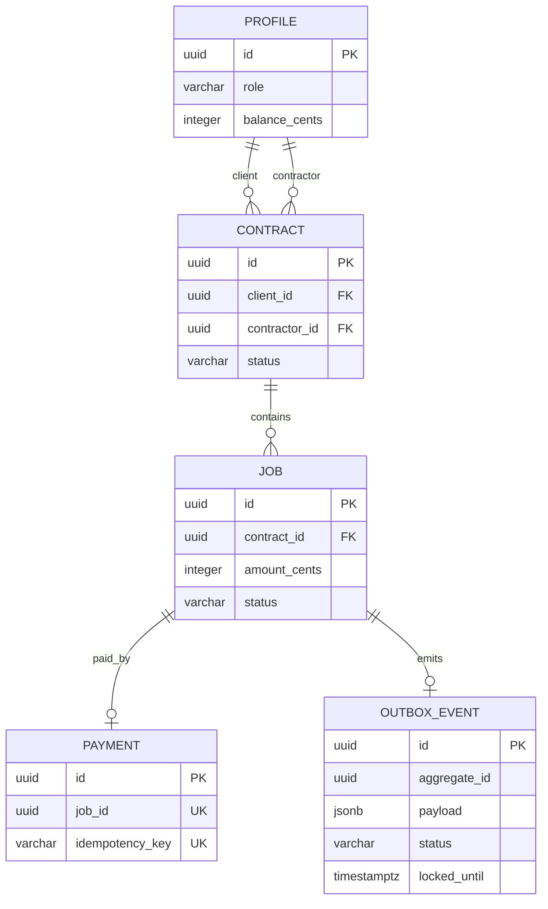
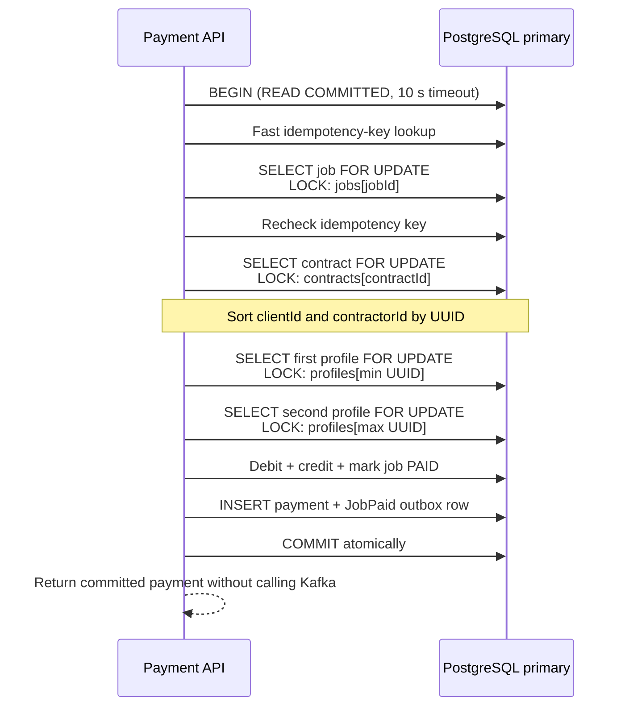
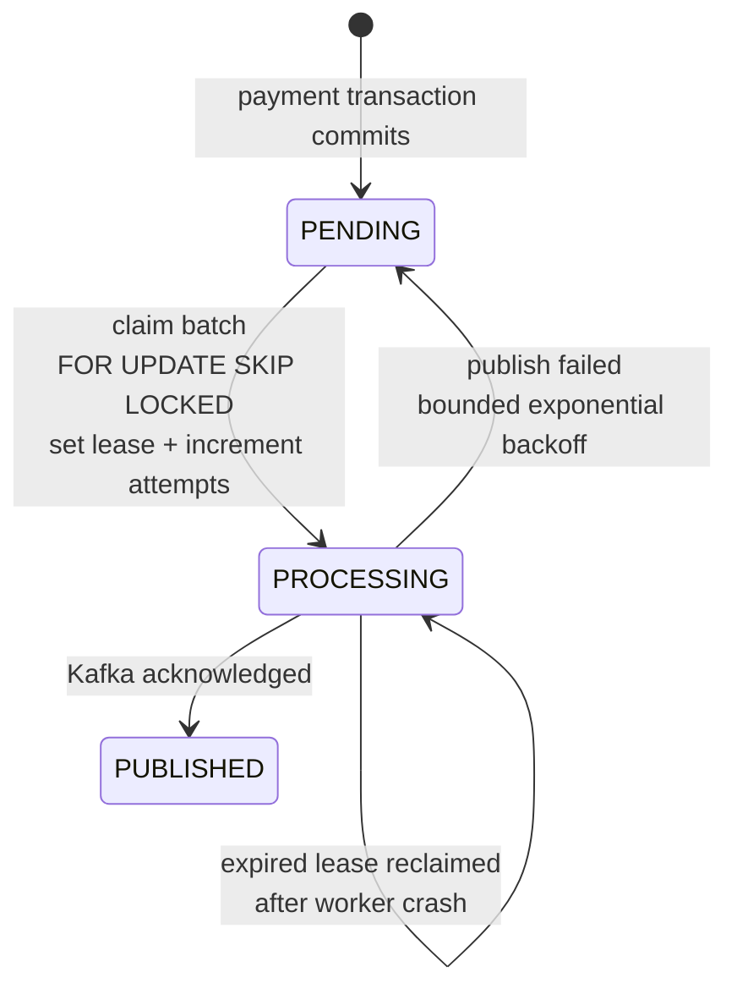
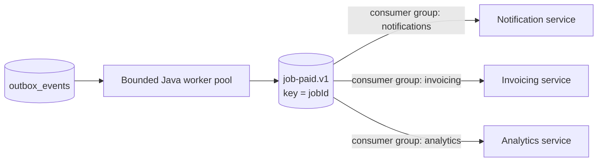

# Client–contractor job payments

A Spring Boot reference project for concurrency-safe job payments. A client funds a job under a contract, a contractor receives the money, and a versioned `JobPaid` event is delivered to Kafka through a transactional outbox.

The project demonstrates Java 21, PostgreSQL row locking, deterministic lock order, database-backed idempotency, atomic transactions, concurrent tests, Kafka at-least-once delivery, and pragmatic hexagonal boundaries. It is an educational service, not a real payment processor.

## Architecture



Domain and application packages contain no Spring, JPA, HTTP, or Kafka imports. Adapters own framework details. Spring configuration wires ports to adapters.



## Payment transaction and locks

PostgreSQL uses `READ COMMITTED`. Correctness comes from locks on the rows used for each decision and from uniqueness constraints.



Every future balance-changing command must use the same profile order. Concurrent payments for one client serialize on that client's row, preventing negative balances and lost updates.

## Transactional outbox and Kafka



Kafka publishing happens after the payment commits. Multiple workers safely claim disjoint batches. Delivery is **at least once**: a crash after Kafka acknowledgment and before `PUBLISHED` can send a duplicate. Consumers must deduplicate the stable `eventId` before applying side effects.



The three services are external consumers, so this repository publishes their shared contract without implementing them. See [the versioned event example](docs/event-contracts/job-paid.v1.json).

## API

| Method | Path | Purpose |
| --- | --- | --- |
| `POST` | `/profiles` | Create client or contractor profile |
| `GET` | `/profiles/{id}` | Read a profile |
| `POST` | `/contracts` | Create an active contract |
| `GET` | `/contracts/{id}` | Read a contract |
| `POST` | `/jobs` | Create an open job |
| `GET` | `/jobs/{id}` | Read a job |
| `POST` | `/jobs/{jobId}/payments` | Pay once; requires `Idempotency-Key` |
| `GET` | `/payments/{id}` | Read a payment |

An identical successful retry returns `200` and `Idempotency-Replayed: true`. The initial payment returns `201`. Reusing a key for another job, or paying an already-paid job with another key, returns `409`.

## Run

Requirements: Docker Compose. Java 21 is needed only when running Maven directly.

```sh
docker compose up -d --wait
./mvnw spring-boot:run
```

The API listens on `127.0.0.1:8080`, PostgreSQL on `127.0.0.1:55435`, and Kafka on `127.0.0.1:29092`.

Run all integration tests using the included test database and Kafka:

```sh
docker compose --profile test up -d --wait
./mvnw clean verify
```

With an older local JDK, run Maven in the official Java 21 container:

```powershell
docker run --rm --network client-contractor-payments-spring_default `
  -v "${PWD}:/workspace" -w /workspace -v contract-maven-cache:/root/.m2 `
  -e TEST_DATABASE_URL=jdbc:postgresql://postgres-test:5432/client_contractor_payments_test `
  -e TEST_KAFKA_BOOTSTRAP_SERVERS=kafka:9092 `
  maven:3.9.11-eclipse-temurin-21 mvn -B clean verify
```

## Indexes, cache, and replicas

| Concern | Decision |
| --- | --- |
| Relationship indexes | Index contract parties and job contract IDs for demonstrated lookups |
| Payment uniqueness | Unique indexes on `job_id` and `idempotency_key` enforce race-safe invariants |
| Outbox polling | Partial `(available_at, created_at)` index covers claimable states |
| Cache | Excluded from balances, job status, idempotency, and outbox state because those require current locked rows |
| Read replicas | Excluded from command-side reads because replication lag breaks read-after-write behavior |

A future reporting adapter may use replicas for explicitly stale-tolerant historical views. Redis should be added only for measured read pressure on immutable or safely invalidated data.

## Verification

Tests use real PostgreSQL and Kafka. Java executors and latches start competing requests together and verify no overspending, no lost updates, one payment per job, idempotency conflicts, full rollback, disjoint outbox claims, expired-lease recovery, retries, and the published event contract.

## Decisions

- [ADR 001: Domain and money](docs/adr/001-domain-and-money.md)
- [ADR 002: Transaction isolation and row locks](docs/adr/002-payment-transaction.md)
- [ADR 003: Idempotency and transactional outbox](docs/adr/003-idempotency-and-messaging.md)
- [ADR 004: Hexagonal boundaries](docs/adr/004-hexagonal-boundaries.md)
- [ADR 005: Cache and read replicas](docs/adr/005-cache-and-read-replicas.md)
